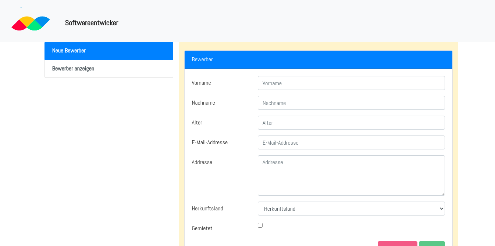

# Application Processor

<<<<<<< HEAD
This is a web based Job application processor created with Aurelia JS in TypeScript, on top of a .NET5 WebAPI and Entity Framework.

## How to build

This project was built using the dotnet-core cli on linux. You need to install the dotnet sdk to build it.

In order to run this project on linux, 

### 1) Get the Repository

Clone the project repository from github by using

    ~$ git clone https://github.com/hugovicfortman/hahn-applicationprocess-december2020.git

or download and extract the repository the zipped archive.

### 2) Navigate to the Web Project

on the terminal from the download path enter the Web

    ~$ cd Hahn.ApplicationProcess.Application/Hahn.ApplicationProcess.December2020.Web

### 3) Build the Project

To build the project, simply run

    ~$ dotnet build

which will restore all the nuget packages and resolve project dependencies

### 4) Running the Project

To run teh project, use

    ~$ dotnet run

This builds the project and runs it. By default, the .netcore cli starts the project at `http://localhost:5000/` with a secure `https` listener at `https://localhost:5001/`

## Swagger UI

The swagger ui contains a visual list of the available API endpoints, and dynamically generated forms with which to interact with them.
For more information on Swagger, see the [Swagger Documentation](https://swagger.io/docs/).

## Custom UI (Aurelia JS)

The custom ui is a simple interactive form built with aurelia js ([aurelia.io](https://aurelia.io/)).

It includes validation, dialogs, and globalization.

## Using the Aurelia UI (As a Separate Host)

To use the aurelia ui, navigate to the UI project from the project root with the following command

    ~$ cd Hahn.ApplicationProcess.December2020.Web/hahn-application-ui

build the project with the following command

    ~$ npm start

This builds and starts the project using a node server at `http://localhost:8080/`

In order for this project to connect to the API, uncomment the following lines in `Startup.cs` file of the Web project

    67 /******** Other code... *********/
    68      services.AddCors(options =>
    69      {
    70          options.AddPolicy("CorsPolicy", builder => builder
    71          .WithOrigins("http://localhost:8080")
    72          .AllowAnyMethod()
    73          .AllowAnyHeader()
    74          .AllowCredentials());
    75      });
    76 /******** Other code... *********/

and

    100     app.UseCors("CorsPolicy");

Doing this enables CORS, cross origin rules for the ui application to connect to and accept data from the web server.

The project is running in testing mode and still uses test data. To change this, modify the `config/environment.json` file by setting `testing` to `false` so that the config shows

    {
      /*... other config constants ...*/
      "testing": false,
      /*... other config constants ...*/
    }

## Using the Aurelia UI (Within Web API Project)

To build the aurelia ui into the web api project, simply run

    ~$ npm build --prod

This will build the project using production settings and optimisation, and copy the bundled code and assets into the folder specified in `outDir`.

The output directory `outDir` has been set to point to the Web project's wwwroot folder which is now be available at `/home`.

For more on the Aurelia project, see the aurelia cli generated README [here](./Hahn.ApplicationProcess.December2020.UI/hahn-application-ui/README.md)
>>>>>>> 9fa1751a621b29b49906a005729036a9a6be976c
